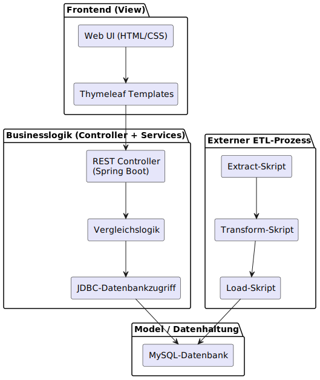
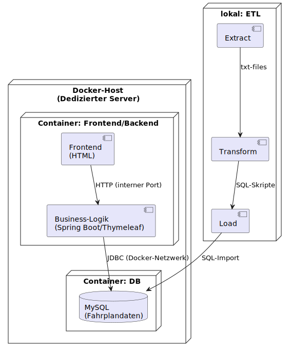

# 🚉 *Anschluss!* – App Suite zur Fahrplananalyse
[Zur Prototypanwendung Anschluss!](https://anschluss.babelbuild.ch)

Willkommen im zentralen Repository zur Masterarbeit **„Anschluss!“** – einer prototypischen Anwendung zur Analyse von Veränderungen zwischen verschiedenen Fahrplanversionen im öffentlichen Verkehr.  
Diese *App Suite* vereint alle relevanten Repositories, Tools und Dokumente für Datenaufbereitung, Analyse und Visualisierung von GTFS-basierten Fahrplandaten.
---

## 🔧 Technical Summary – Projekt *Anschluss!*

**Anschluss!** ist eine prototypische Webanwendung zur Analyse von Fahrplanänderungen im öffentlichen Verkehr. Ziel ist es, kritische Veränderungen – insbesondere beim Übergang vom Bahn- zum Busverkehr – frühzeitig zu erkennen.
Die Anwendung basiert auf dem **GTFS-Datenstandard** und nutzt einen mehrstufigen **ETL-Prozess**, um GTFS-Rohdaten zu analysieren, zu transformieren und in eine **MySQL-Datenbank** zu überführen. 
Das Backend wurde mit **Spring Boot** entwickelt, das Frontend nutzt **Thymeleaf** und **Bootstrap**. Über die **Google Maps API** werden Haltestellen auf GoogleMaps interaktiv dargestellt. 
Zentrale Funktion ist der **Fahrplanvergleich**, bei dem zwei GTFS-Fahrplanversionen auf Änderungen bei Zugankünften analysiert werden können. Dadurch lassen sich potenzielle Anschlussbrüche erkennen.

🚀 Die App wurde vollständig entwickelt, getestet und ansatzweise evaluiert. Nutzerfeddbacks sind noch ausstehend.  Die Anwendung leistet die Arbeit einen praxisnahen Beitrag zur Digitalisierung und zur verbesserten Koordination im öffentlichen Verkehr 

> ⚠️ Hinweis: Der Prototyp befindet sich noch in der Weiterentwicklung – Feedback willkommen!

---

## 🔗 Komponentenübersicht

| 🧩 Komponente         | 📄 Beschreibung                                                  | 🔗 Repository Link                                                                 |
|----------------------|------------------------------------------------------------------|------------------------------------------------------------------------------------|
| 🌐 Spring Boot App    | Enthält Frontend & Backend der Webanwendung                     | [anschluss_v1_1](https://github.com/schegste/anschluss_v1_1)                      |
| 🗄 SQL-Skripte         | SQL-Statements zur GTFS-Datenbankstruktur                       | [0_sql_Statements](https://github.com/schegste/0_sql_Statements)                  |
| 📦 Extract            | Skripte zur Modifikation der GTFS-Rohdaten                      | [01_transform_gtfs_txt_data_v1](https://github.com/schegste/01_transform_gtfs_txt_data_v1) |
| 🔁 Transfer           | GTFS-Text → SQL-Konvertierungsskripte                           | [02_transform_txt_to_sql_v1](https://github.com/schegste/02_transform_txt_to_sql_v1) |
| 🧰 Load               | Erstellt & befüllt die GTFS-Datenbank                           | [03_create_load_gtfs_db_v1](https://github.com/schegste/03_create_load_gtfs_db_v1) |
| 📘 Masterarbeit        | PDF-Dokumentation inkl. Anhänge                                 | [Dokumente_MaTh_Anschluss_SSchegg](https://github.com/schegste/Dokumente_MaTh_Anschluss_SSchegg) |

---

### 🛠 Architekturkonzept

### 🔧 Deployment-Kontext

## 📥 Nutzungshinweise

Die Repositories sind modular aufgebaut und können einzeln verwendet oder geklont werden.  
🔒 *Einige Repositories sind privat. Zugriffsanfragen bitte an* **Stefan Schegg** *richten.*
📬 Kontakt: stefan[at]schegg.ch

---

## 🛠 Architekturüberblick *(folgt bald)*

In Kürze verfügbar unter dem Pfad: [`/docs`](./docs)

## 🧾 Changelog
- v1.1.1: Initiale Version am 29.06.25 aufgeschaltet

## 📚 Zitation
Wenn Sie dieses Projekt wissenschaftlich verwenden, zitieren Sie bitte:
Schegg, S. (2025). *Anschluss! – Entwicklung einer Webanwendung zur Beurteilung von Fahrplanänderungen*. Masterarbeit, ZHAW.

